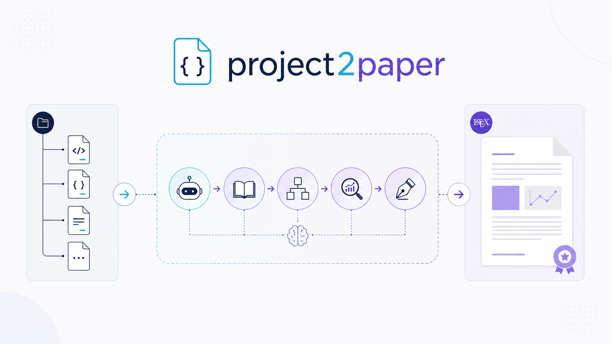
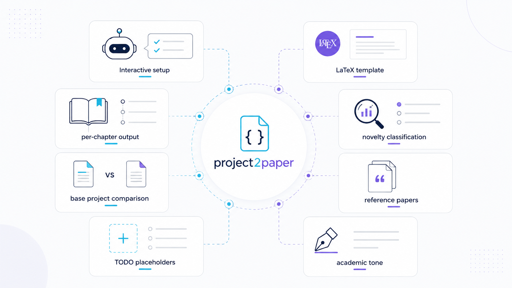
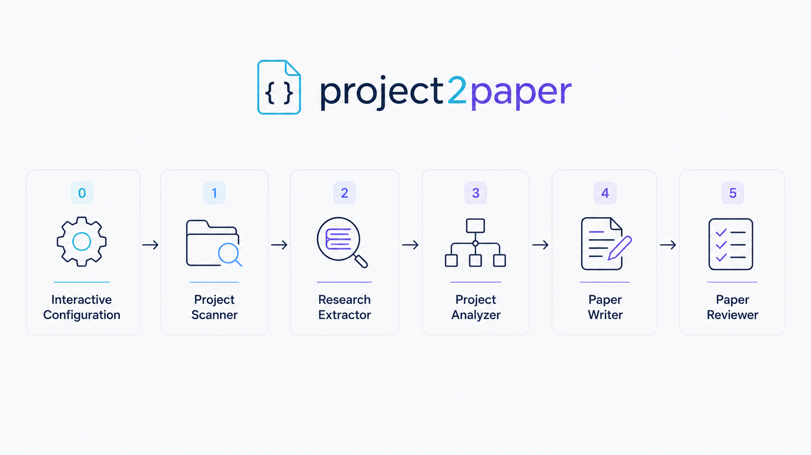
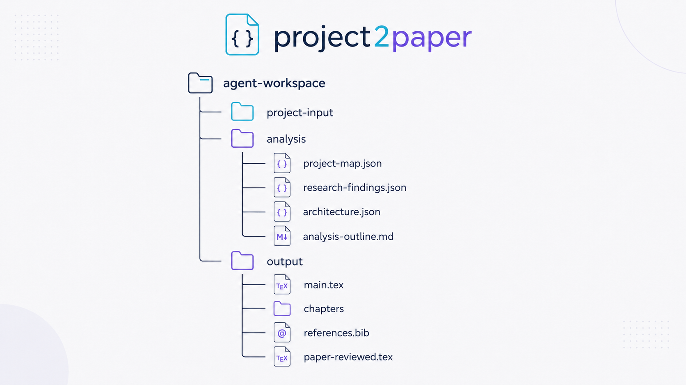
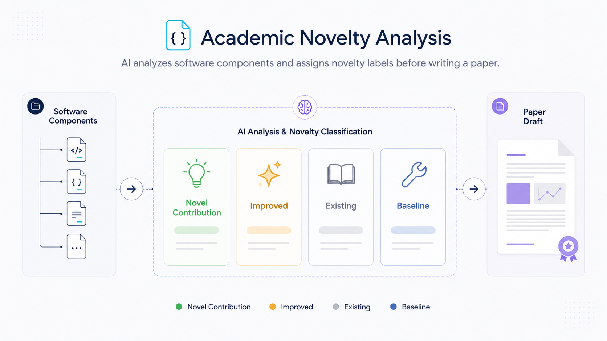
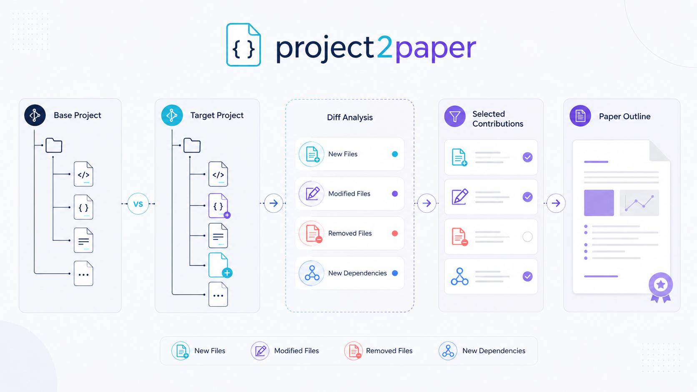

# project2paper

**Turn any codebase into a well-structured technical paper.**

<p align="center">
  
</p>

A 6-phase agent pipeline that analyzes any project and produces a publication-quality paper. Works with **Claude Code** (slash command) and **OpenCode** (skill).

```
/project2paper /path/to/project --format latex --novelty

  ● Phase 0: interactive config → gather settings, template, references
  ● Phase 1: project-scanner   → project structure mapped
  ● Phase 2: research-extractor → base models & patterns found
  ● Phase 3: project-analyzer  → novelty classified, outline generated
  ● Phase 4: paper-writer      → per-chapter paper drafted
  ● Phase 5: paper-reviewer    → paper reviewed and refined
  │
  ✓ agent-workspace/output/main.tex (+ chapters/) — done
```

---

## Features

- **Interactive setup** — Guided prompts for project path, paper type, template, references
- **Your own LaTeX template** — Bring your own `.tex` template; the system uses its preamble
- **Per-chapter output** — Each section as a separate `.tex` file under `output/chapters/`
- **Novelty classification** — Inline markers distinguish novel work from existing (🆕 Novel / ✨ Improved / 📚 Existing / 🔧 Baseline)
- **Base project comparison** — Compare against a baseline project to automatically detect contributions
- **Reference papers** — Provide arXiv IDs, DOIs, or PDFs; they are cited in the paper
- **Placeholders** — Missing content gets `\todo{}` and `\missingfigure{}` markers
- **Academic tone** — Formal, third-person, problem-to-solution flow by default

<p align="center">
  
</p>

---

## Quick Start

### Claude Code

```bash
# 1. Add the marketplace (one-time)
claude plugins marketplace add https://github.com/evolll/project2paper

# 2. Install the plugin
claude plugins install project2paper

# 3. Run in Claude Code (interactive — you will be prompted for all settings)
/project2paper

# 4. Or pass a project path directly
/project2paper /path/to/your-project
```

### OpenCode

```bash
# 1. Clone to global skills (one-time)
git clone https://github.com/evolll/project2paper.git ~/.config/opencode/skills/project2paper

# 2. In OpenCode, tell the agent:
run project2paper on /path/to/project
```

---

## Usage

All arguments are optional. If omitted, you will be prompted interactively.

```
/project2paper
/project2paper /path/to/project
/project2paper /path/to/project --format latex --novelty
/project2paper /path/to/project --base /path/to/base-project --format latex
```

### Arguments

| Argument | Default | Description |
|----------|---------|-------------|
| `<path>` | prompted | Path to the project to analyze |
| `--base` | none | Path to a baseline project for comparison |
| `--format` | latex | Output format: `markdown`, `latex`, `html` |
| `--interactive` | true | Enable phase-by-phase interaction (default: on) |
| `--novelty` | true | Highlight existing work vs novel contributions (default: on) |

---

## Pipeline

<p align="center">
  
</p>

The command executes **6 phases** sequentially. Each phase reads its agent prompt, processes the project, and saves output to `agent-workspace/`.

### Phase 0 — Interactive Configuration

**Prompt:** `agents/project-scanner.md`

Gathers all settings from the user interactively:
1. **Project path** — Path to the codebase (required)
2. **Paper type** — Technical Report (short), Journal/Conference Paper (medium), or Thesis (long)
3. **Output format** — LaTeX, Markdown, or HTML
4. **LaTeX template** — If LaTeX: **required**. You provide the path to your own `.tex` template file. The system validates it exists, reads its preamble, and uses it as the document basis.
5. **Base project** — Optional path to a baseline project for comparison
6. **Reference papers** — Optional arXiv IDs, DOIs, URLs, or PDF paths

**Output:** `agent-workspace/project-input/config.json`

### Phase 1 — Project Scanner

**Prompt:** `agents/project-scanner.md`

Scans the project directory, catalogs files, detects language and framework. If a base project was provided, both projects are scanned and compared — new files, modified files, removed files, and dependency changes are listed, and you select which areas to treat as contributions.

**Output:** `agent-workspace/analysis/project-map.json`

### Phase 2 — Research Extractor (Literature Search)

**Prompt:** `agents/research-extractor.md`

Analyzes project dependencies and source code to identify base models, known design patterns, and existing work. Flags potential novelty zones for Phase 3. If reference papers were provided, searches for similarities between the project and referenced work.

**Output:** `agent-workspace/analysis/research-findings.json`

### Phase 3 — Project Analyzer (Novelty Analysis + Outline)

**Prompt:** `agents/project-analyzer.md`

Analyzes architecture using Phase 2 context. Each component is classified as novel, improved, existing, or baseline with evidence. An analysis outline is generated for user review. In interactive mode, you can review and modify the outline until confirmed.

**Outputs:** `agent-workspace/analysis/architecture.json` + `agent-workspace/analysis/analysis-outline.md`

### Phase 4 — Paper Writer

**Prompt:** `agents/paper-writer.md`

Generates the paper based on all previous analysis:

- **LaTeX:** Reads your template's preamble, writes `main.tex` with `\input{chapters/...}` for each section. Uses `\input` (not `\include`) to avoid forced page breaks between chapters.
- **Markdown/HTML:** Writes a single output file.
- Missing content gets `\todo{}` (text) and `\missingfigure{}` (diagram) placeholders.
- References are cited as `\cite{}` and a `references.bib` is generated.

**Output:** `agent-workspace/output/main.tex` + `chapters/*.tex` (LaTeX) or `paper.{md|html}`

### Phase 5 — Paper Reviewer

**Prompt:** `agents/paper-reviewer.md`

Reviews the generated paper for length compliance, academic tone, novelty marker accuracy, and claim verifiability. Fixes issues directly and produces the final version.

**Output:** `agent-workspace/output/paper-reviewed.{md|tex|html}`

---

## Output Structure

<p align="center">
  
</p>

```
agent-workspace/
├── project-input/config.json          # All user settings
├── analysis/
│   ├── project-map.json               # Phase 1: scanned project structure
│   ├── research-findings.json         # Phase 2: base models & patterns
│   ├── architecture.json              # Phase 3: architecture + novelty
│   └── analysis-outline.md            # Phase 3: outline for review
├── output/
│   ├── user-template.tex              # Backup of your template
│   ├── main.tex                       # Root LaTeX file (\input{chapters/...})
│   ├── chapters/                      # Per-chapter .tex files
│   │   ├── 00-abstract.tex
│   │   ├── 01-introduction.tex
│   │   ├── 02-architecture.tex
│   │   ├── 03-components.tex          # (medium+)
│   │   ├── 04-design-decisions.tex    # (medium+)
│   │   ├── 05-discussion.tex
│   │   ├── 06-conclusion.tex
│   │   └── 07-references.tex          # (medium+)
│   ├── references.bib                 # BibTeX file (if refs provided)
│   ├── paper.md                       # Markdown output (if format=markdown)
│   ├── paper.html                     # HTML output (if format=html)
│   └── paper-reviewed.*               # Phase 5: final reviewed paper
└── templates/
    └── latex/                         # Example references only
        ├── article-chapter.tex
        ├── ieee-chapter.tex
        └── acm-chapter.tex
```

---

## Novelty Classification

<p align="center">
  
</p>

When `--novelty` is enabled, every component, feature, and design decision is classified and marked inline:

| Marker | Meaning | Color |
|--------|---------|-------|
| 🆕 **Novel Contribution** | Truly new approach, algorithm, or design | Green |
| ✨ **Improved** | Adapted or optimized from prior work | Amber |
| 📚 **Existing** | Prior work or dependency | Gray |
| 🔧 **Baseline** | Common / standard practice | Blue |

A legend and summary table are included in the output.

### Novelty Modes

- **Auto mode** (default) — AI automatically discovers novelty by analyzing the codebase
- **Manual mode** — You describe what's novel and what's existing work; the agent uses your hints

---

## Interactive Mode

When `--interactive` is enabled (default: true), the agent pauses after each phase:

1. **Phase 0:** Gathers all settings (project path, paper type, template, references, base)
2. **Phase 1:** Shows project summary; asks for novelty mode (manual/auto); if base comparison, shows diff and asks which areas are contributions
3. **Phase 2:** Shows research findings; allows adding related work
4. **Phase 3:** Presents analysis outline for review; loop until confirmed
5. **Phase 4:** Shows draft output path; asks for adjustments
6. **Phase 5:** Confirms final output

---

## Base Project Comparison

<p align="center">
  
</p>

When `--base /path/to/base-project` is used:

1. Both projects are scanned and compared (files, dependencies, features)
2. A diff is presented: new files, modified files, removed files, new dependencies
3. You select which detected areas should be treated as paper contributions
4. The paper is structured around the delta between base and target

---

## LaTeX Template Requirements

Your `.tex` template must:
- Be a valid LaTeX file with `\begin{document}` and `\end{document}`
- Define the document class, packages, and style you want
- The system reads the preamble and injects `\input{chapters/...}` between `\begin{document}` and `\end{document}`

Example template structure:
```latex
\documentclass[11pt,a4paper]{article}
\usepackage[utf8]{inputenc}
\usepackage{graphicx}
\usepackage{hyperref}
% ...your packages...

\title{Paper Title}
\author{Author Name}

\begin{document}
\maketitle
% → System inserts: \input{chapters/00-abstract}
% → System inserts: \input{chapters/01-introduction}
% etc.
\end{document}
```

---

## Project Structure

```
project2paper/
├── .claude-plugin/
│   ├── plugin.json                   # Claude Code plugin registration
│   └── marketplace.json              # Marketplace listing
├── .opencode/skills/project2paper/
│   └── SKILL.md                      # OpenCode skill definition
├── skills/project2paper/
│   └── SKILL.md                      # Claude Code command definition
├── agents/
│   ├── project-scanner.md            # Phase 0 + 1: config + scan
│   ├── research-extractor.md         # Phase 2: literature search
│   ├── project-analyzer.md           # Phase 3: novelty analysis + outline
│   ├── paper-writer.md               # Phase 4: paper generation
│   └── paper-reviewer.md             # Phase 5: review and refine
├── agent-workspace/
│   ├── agent_helpers.py              # Helper library (prompts, markers, chapters)
│   ├── templates/                    # Example reference templates
│   ├── project-input/                # Config (generated)
│   ├── analysis/                     # Intermediate artifacts
│   └── output/                       # Final paper
├── CLAUDE.md                         # Auto-read by Claude Code
├── SKILL.md                          # Usage reference
└── AGENTS.md                         # Agent architecture guide
```

---

## License

MIT
